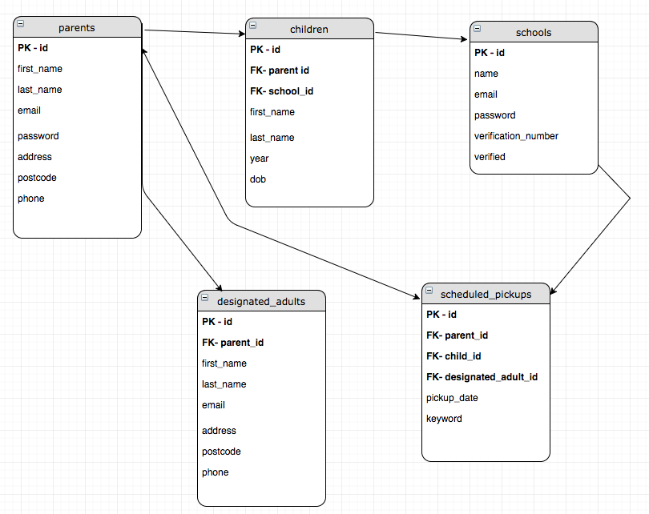

# homesafe

https://homesafefac.herokuapp.com/
By Fatimat, Dragomir, Kitty and Sophie.

A web app to allow parents to notify school if someone other than the regular guardian will be picking up the child from school.

## The challenge HomeSafe tackles
Primary schools in the London area regularly have no specific way to ensure a child is being picked up by the correct guardian. Many schools have a call-in system whereby the parent will notify the school by calling in. This current system leaves the school with no way of tracking this information, or safely ensuring that the child is being picked up by the correct guardian.

## What HomeSafe does
HomeSafe allows parents to notify their child's school if someone other than their regular guardian will be picking their child up from school. The app lets both parents and schools login securely and share a chosen keyword that will be repeated by a designated adult/guardian when picking up the child.

### User journeys
#### Parent
* I want to be able to register or login securely
* I want to be able to add my child
* I want to be able to add designated adults
* I want to be able to schedule a pickup
* I want to be able to logout

#### School
* I want to be able to register or login securely
* I want to be able to see a list of organised pickups

## Tech Stack
Express server, handlebars, and a postgreSQL database.

#### How to build the app
Our app uses the following devDependencies
* babel-watch
* eslint
* nodemon
* supertest
* tap-spec
* tape
You will need to create a local database

#### Sofware architecture - schema

